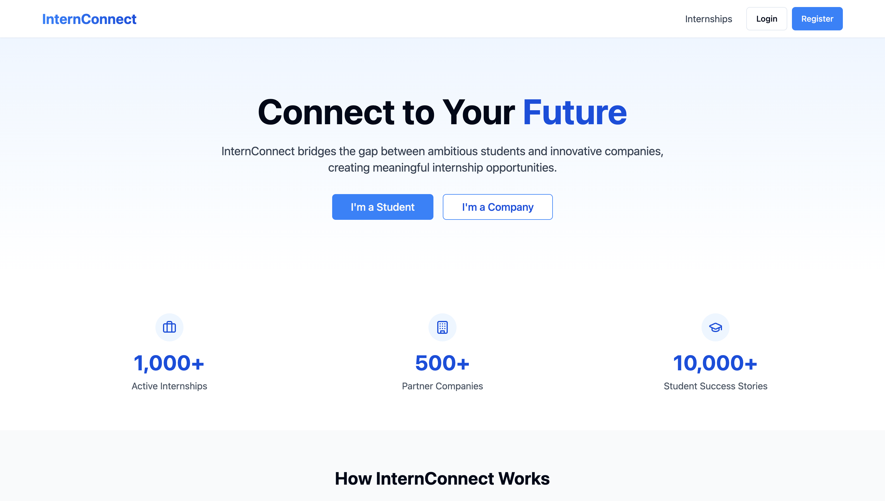
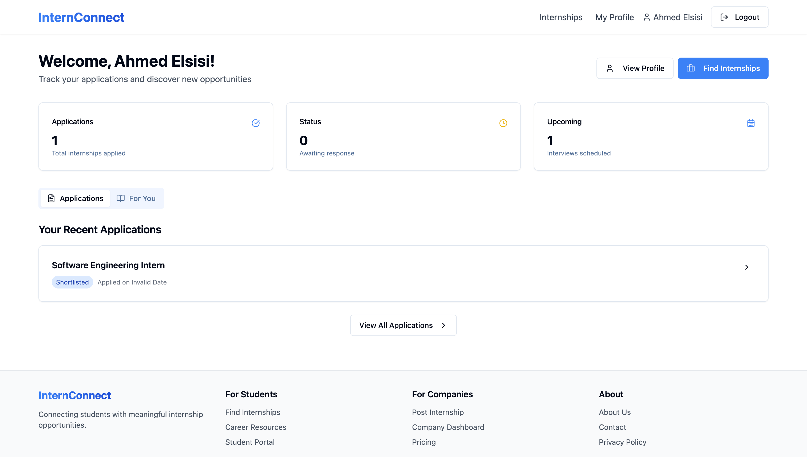
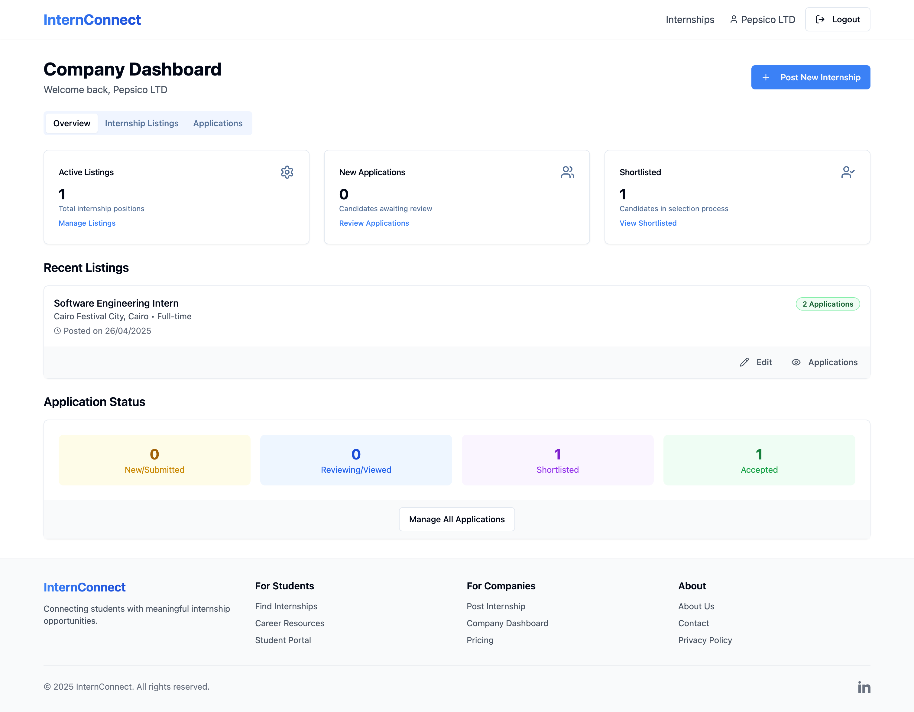
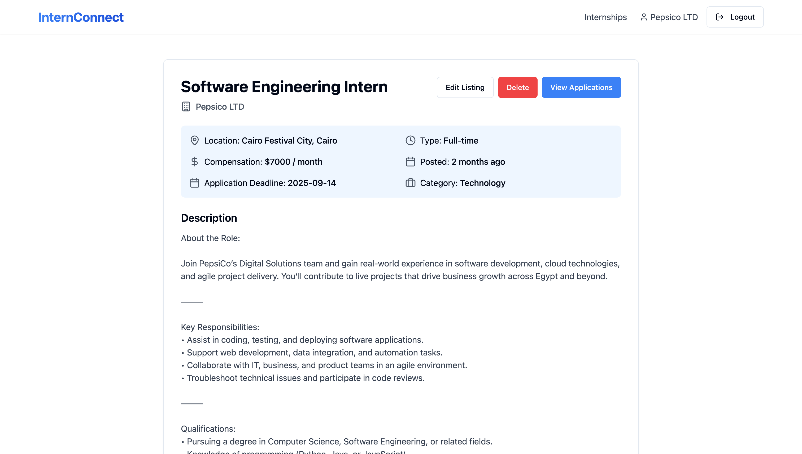
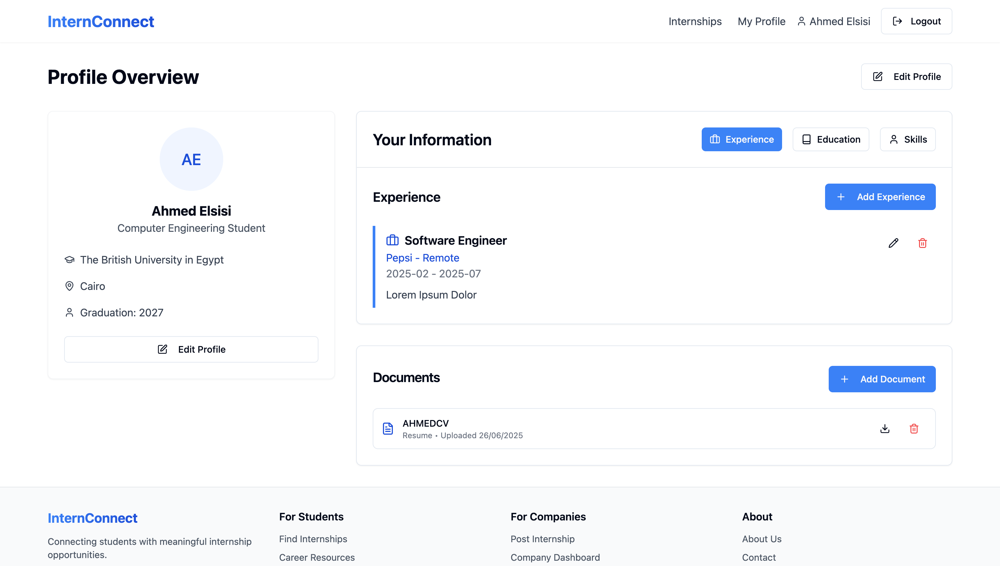
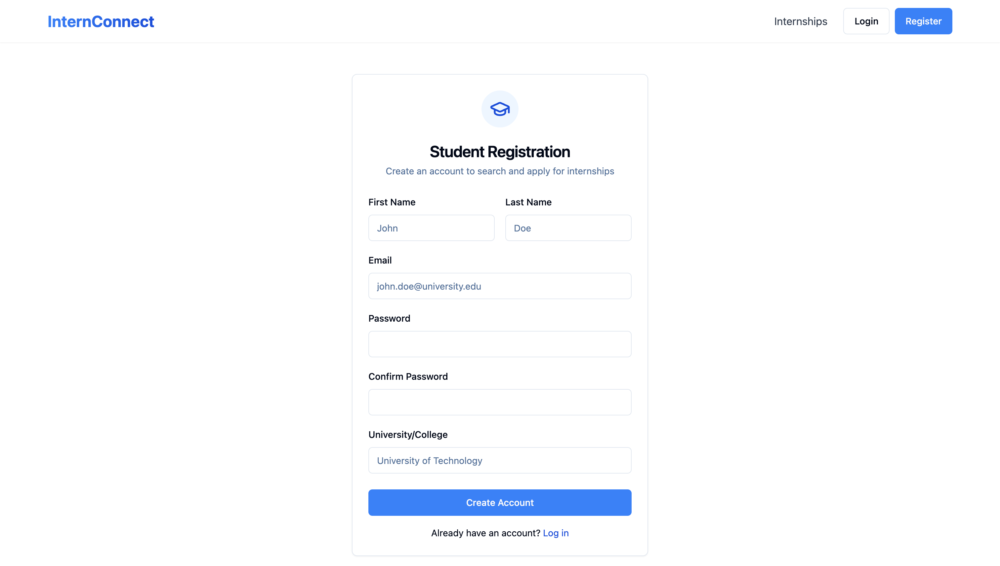

# InternConnect

A platform for connecting students and companies for internships.

## Tech Stack

- **Frontend:** React (with TypeScript), Vite, Tailwind CSS
- **State Management:** React Context API
- **Icons:** Lucide React
- **Backend:** [Supabase](https://supabase.com/) (PostgreSQL, Auth, Storage)

### Supabase Integration
This app uses Supabase as a backend-as-a-service platform. It leverages Supabase for:
- User authentication and authorization
- Storing and retrieving user profiles and internship data
- Real-time updates and secure access to data

All sensitive credentials (such as the Supabase URL and Anon Key) are managed via environment variables and are never committed to the repository.

## Screenshots

### Main Page


### Dashboard


### Company Dashboard


### Internship


### Profile


### Signup


## Getting Started

1. **Clone the repository:**
   ```sh
   git clone https://github.com/ahmadccplus/InternConnect.git
   cd InternConnect
   ```
2. **Install dependencies:**
   ```sh
   npm install
   # or
   yarn install
   ```
3. **Set up environment variables:**
   - Copy `.env.example` to `.env` and fill in your actual credentials.

4. **Run the development server:**
   ```sh
   npm run dev
   # or
   yarn dev
   ```

## Environment Variables
See `.env.example` for required variables.

## License
Copyright (C) 2025 Ahmed Elsisi. All Rights Reserved.

This software is proprietary and confidential. Unauthorized copying, distribution, or modification of any part of this project, via any medium, is strictly prohibited without the author's permission.

For inquiries, please contact: ahmedwelsisi@gmail.com
